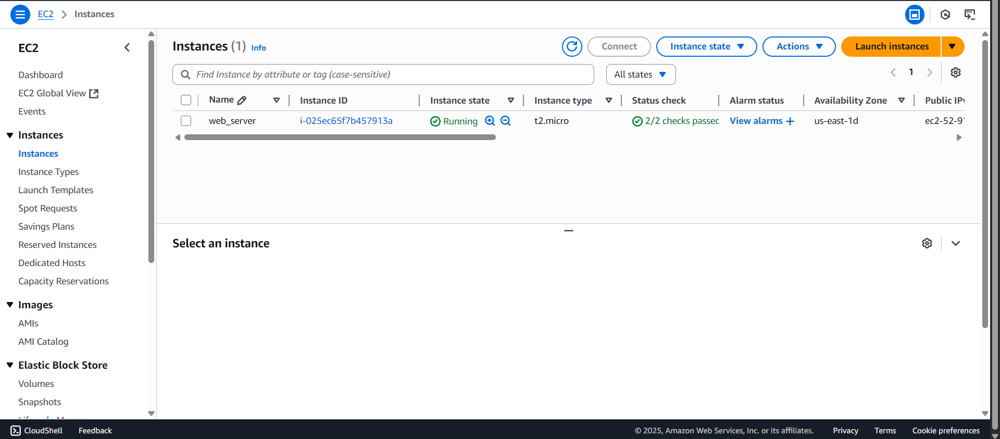
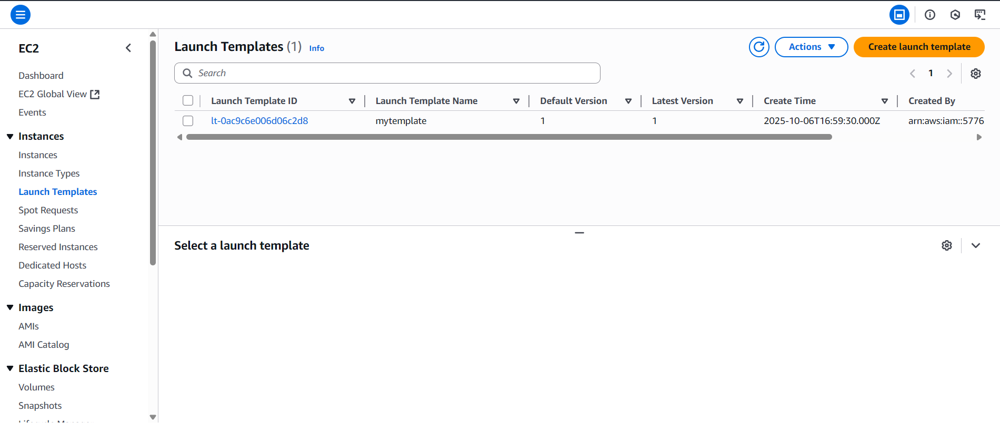
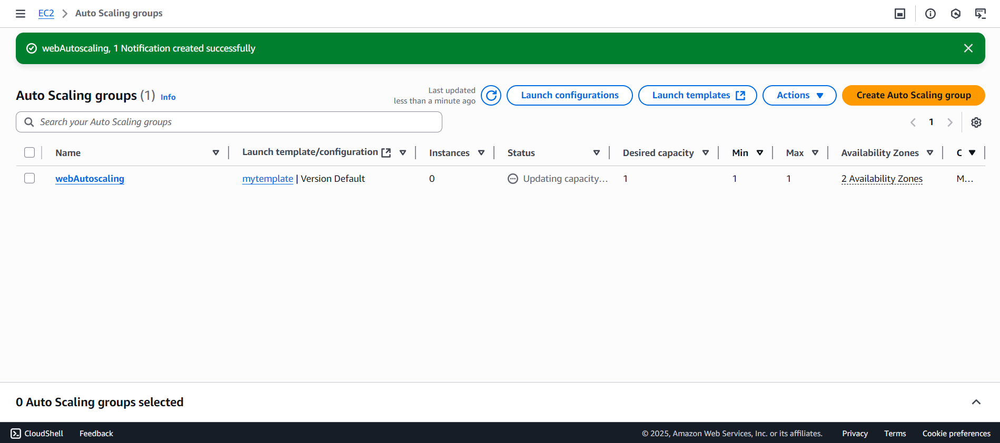
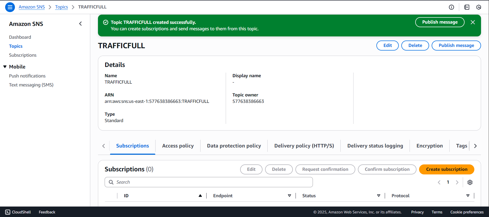
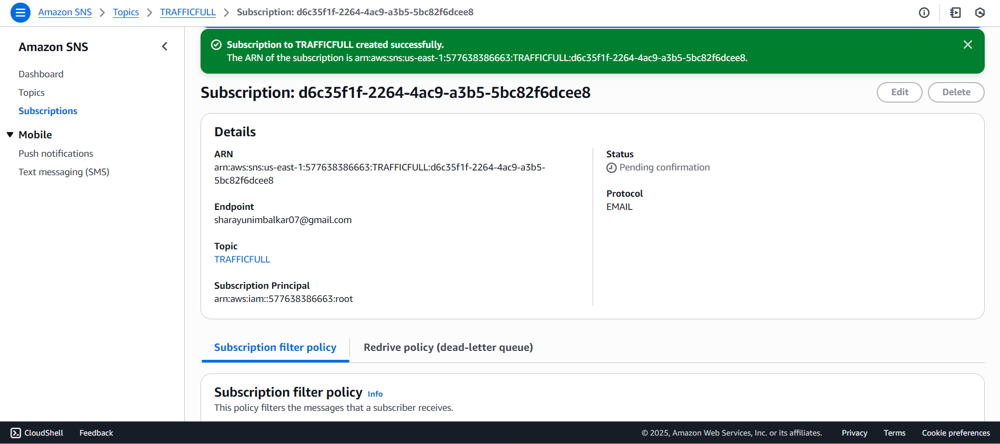
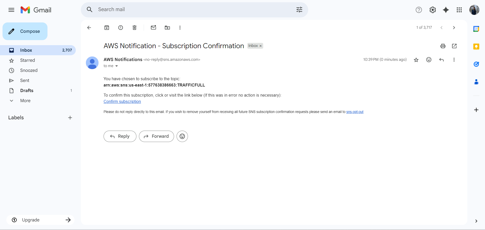
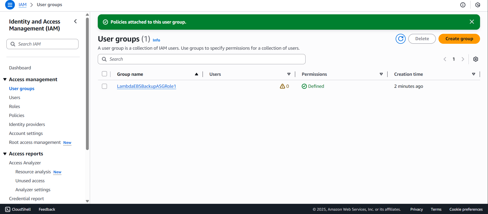
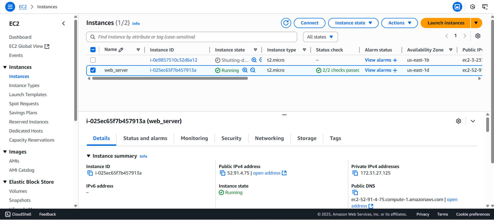

# Automated-EBS-Snapshot-Backup-using-AWS-Lambda-SNS
Aws-project

🧠 Project Overview

This project automates the creation of EBS snapshots for EC2 instances managed by an Auto Scaling Group (ASG).
It uses AWS Lambda, SNS, and Auto Scaling Lifecycle Hooks to automatically take EBS backups when new instances are launched — no need to manually tag volumes.

🏗️ Architecture

Components:

Auto Scaling Group (ASG): Manages EC2 instances automatically.
Lifecycle Hooks: Trigger events when instances are launched or terminated.
SNS Topic: Sends notifications to Lambda and email subscribers.
Lambda Function: Creates EBS snapshots automatically.
IAM Role: Grants necessary EC2, SNS, and CloudWatch permissions.

Flow:

[AutoScaling Group] → [Lifecycle Hook] → [SNS Topic] → [Lambda Function] → [EBS Snapshot]
                                                   ↳ [Email Notification via SNS]

⚙️ Technologies Used
AWS EC2
AWS Auto Scaling Group
AWS Lambda (Python 3.12)
Amazon SNS
Amazon CloudWatch (for monitoring)
IAM Roles and Policies
Policies

🚀 Features

✅ Automated snapshot creation for ASG instances
✅ Email notification after backup completion
✅ Event-driven backup (no cron/schedule needed)
✅ Scalable and cost-efficient
✅ Optional cleanup logic for old snapshots

🪜 Implementation Steps

1. Create Launch Template :
Define AMI, instance type, key pair, and security group.
Add a tag:
Key: Project
Value: EBSBackupASG

2. Create Auto Scaling Group (ASG)
Use the launch template created above.
Configure desired capacity, subnets, and scaling policies.
Add Lifecycle Hooks:
BackupOnLaunch (for instance launch events)
CleanupOnTerminate (optional for deleting old snapshots)

    

3. Create SNS Topic
Create a topic named: ebs-snapshot-notification
Add an Email Subscription and confirm it from your inbox.

    

    

4. Create IAM Role for Lambda

Attach these policies to the role:

AmazonEC2FullAccess
AmazonSNSFullAccess
CloudWatchLogsFullAccess

Name the role: LambdaEBSBackupASGRole

 

5. Create Lambda Function
Name: ASG_EBS_Backup
Runtime: Python 3.12
Role: LambdaEBSBackupASGRole
Environment Variable:
SNS_TOPIC_ARN = your SNS topic ARN

 

6. Connect ASG with Lambda
Go to Auto Scaling Group → Lifecycle Hooks
Edit BackupOnLaunch:
Notification Target: SNS Topic
Lambda Trigger: ASG_EBS_Backup

Repeat the same for CleanupOnTerminate if needed.

7. Test
Scale up the Auto Scaling Group.
When a new instance launches:
Lambda will trigger automatically.
EBS snapshots will be created.
An email notification will be sent to your SNS subscriber.

 

🧩 Folder Structure
Automated-EBS-Snapshot-Backup-using-AWS-Lambda-SNS/
│
├── lambda_function.py
└── README.md

📬 Output
Snapshots appear in EC2 → Snapshots
Email notification from SNS showing snapshot IDs
